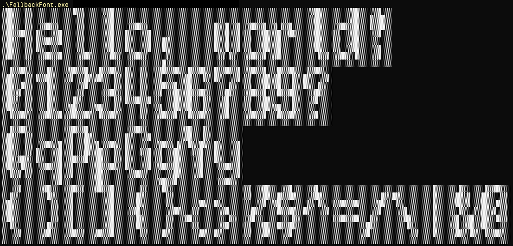

# FallbackFont
A neat way to embed a fall-back font into a C/C++ program, which results in readable code and an ASCII table

## Sample usage

```c++
void writeLine(const char* const message) {
    for (int row = 0; row < 8; ++row) {
        auto curs = message;
        while (*curs != 0) {
            auto g = fallbackCharToGlyph(*curs)[row];  // Read the character here
            for (int col = 0; col < 8; ++col) {
                printf("%s", ((g & 0x80) != 0) ? filled : empty);
                g <<= 1;
            }
            curs++;
        }
        printf("%s\r\n", empty);
    }
}

int main() {
    writeLine("Hello, world!");
    writeLine("0123456789?");
    writeLine("QqPpGgYy");
    writeLine("()[]{}<>%$^=/\\|&@");
}
```



## Character definition

Character defined as
```c++
char ch_A[8] = {
    __XXX__,
    _XX_XX_,
    XX___XX,
    XX___XX,
    XXXXXXX,
    XX___XX,
    XX___XX,
    _______
};
```

outputs like

```plain
  ███  
 ██ ██ 
██   ██
██   ██
███████
██   ██
██   ██
       
```
